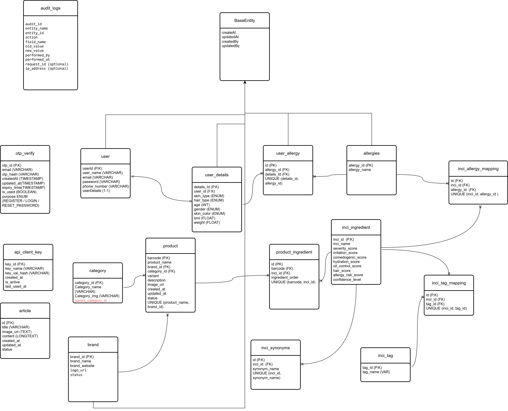

<div align="center">


# TruWiz Backend

### Know Before You Use

**AI-powered cosmetic ingredient intelligence — built on deterministic science, explained in plain English.**

<br/>


<br/><br/>

[Getting Started](#getting-started) · [API Docs](#swagger-documentation) · [Architecture](#system-architecture) · [Roadmap](#roadmap)

</div>

<br/>

## Overview

TruWiz analyzes cosmetic ingredients against an individual's skin type, hair type, and known allergies to determine whether a product is actually suitable for them — not a generic star rating, but a personalized, evidence-based verdict.

What sets TruWiz apart is architectural: **scoring and explanation are strictly separated.** A deterministic scientific engine computes every score first. Only after the numbers are final does a Large Language Model step in — and its sole job is to translate those numbers into a clear, human-readable explanation. The AI never sees an ingredient it can rate on its own, and it never touches a score once one exists.

<br/>

## Application Preview

<div align="center">

<a href="docs/videos/app-demo.mp4">
  
</a>

<sub>Click the preview above to watch the full demo (MP4). GitHub does not support inline MP4 playback — swap this asset for a GIF if you want the preview to autoplay directly in the README.</sub>

</div>

<br/>

## Key Features

<table>
<tr>
<td width="50%" valign="top">

**Authentication & Identity**
- JWT-based stateless authentication
- Email OTP verification
- Role-based access control

**User Profiling**
- Skin type classification
- Hair type classification
- Allergy and sensitivity mapping

**Catalog Management**
- Brand management
- Category management
- Full product catalog

</td>
<td width="50%" valign="top">

**Ingredient Intelligence**
- INCI ingredient database
- Ingredient synonym resolution
- Ingredient tagging system
- Ingredient–allergy mapping

**Analysis Engine**
- Deterministic scientific scoring
- Position-based ingredient weighting
- Personalized product analysis
- LLM-powered explanation layer

**Platform**
- Audit logging
- Public developer API
- OCR ingredient extraction *(planned)*

</td>
</tr>
</table>

<br/>

## Why TruWiz Is Different

| | Traditional Cosmetic Apps | TruWiz |
|---|---|---|
| **Scoring** | Opaque, editorial, or crowd-sourced | Deterministic, formula-driven scientific engine |
| **Personalization** | Generic ratings for all users | Matched against skin type, hair type, and allergies |
| **Role of AI** | Often generates the rating itself | Explains a score it cannot change or override |
| **Transparency** | "Black box" verdicts | Every score is traceable to a scientific calculation |
| **Trust model** | Rating and reasoning are entangled | Rating and reasoning are architecturally separated |

<br/>

## Core Engine

Every ingredient is evaluated against a multi-metric scientific model:

| Metric | Description |
|---|---|
| Safety | Overall safety profile of the ingredient |
| Irritation | Likelihood of causing skin/scalp irritation |
| Comedogenic | Pore-clogging potential |
| Hydration | Moisturizing contribution |
| Sebum Control | Effect on oil regulation |
| Hair Benefit | Contribution to hair health outcomes |
| Allergy Risk | Risk relative to the user's declared allergies |
| Confidence | Reliability of the underlying data for this ingredient |

**Position-based weighting.** Ingredient order in a formulation reflects concentration. TruWiz weights ingredients accordingly — those listed earlier in the INCI list contribute more heavily to the final score, mirroring how formulations are actually read by chemists.

**The AI explanation boundary.** Once scoring is complete, a structured JSON payload — not raw text — is passed to the LLM. The LLM's role is strictly bounded:

```
✔ Convert structured scores into natural-language explanations
✔ Highlight the ingredients driving a result
✔ Communicate findings in plain, accessible English

✘ Cannot modify scores
✘ Cannot invent risks
✘ Cannot override calculations
✘ Cannot manipulate ingredient ratings
```

This boundary is what makes TruWiz's output auditable: every explanation the user reads traces back to a deterministic calculation, not a language model's judgment call.

<br/>

## System Architecture

```
┌──────────────┐      ┌──────────────────┐      ┌─────────────────────┐
│   Client /    │─────▶│   Spring Boot      │─────▶│   Spring Security    │
│   Public API  │      │   REST Layer       │      │   (JWT + OTP)        │
└──────────────┘      └──────────────────┘      └─────────────────────┘
                               │
                               ▼
                    ┌────────────────────┐
                    │  Service Layer       │
                    │  (Business Logic)    │
                    └────────────────────┘
                               │
              ┌────────────────┼────────────────┐
              ▼                                   ▼
   ┌─────────────────────┐            ┌─────────────────────┐
   │  Scientific Scoring   │            │  LLM Explanation      │
   │  Engine (Deterministic)│──scores──▶│  Layer (Gemini/OpenAI) │
   └─────────────────────┘            └─────────────────────┘
              │
              ▼
   ┌─────────────────────┐
   │  Spring Data JPA /     │
   │  Hibernate / MySQL     │
   └─────────────────────┘
```

<br/>

## Product Analysis Flow

```
Product Search
      │
      ▼
Ingredient Extraction
      │
      ▼
Synonym Resolution
      │
      ▼
INCI Database Lookup
      │
      ▼
Scientific Ingredient Analysis
      │
      ▼
Position Weighting
      │
      ▼
User Profile Matching
      │
      ▼
Final Product Score
      │
      ▼
LLM Explanation
      │
      ▼
Personalized Safety Report
```

<br/>

## Database Schema

<div align="center">

</div>

The schema centers on a normalized ingredient model: products reference INCI entries through a synonym-resolution layer, while allergy mappings and user profiles join at query time to produce a personalized score — keeping the scientific data reusable across every user rather than duplicated per profile.

<br/>

## Tech Stack

| Layer | Technology |
|---|---|
| Language | Java 21 |
| Framework | Spring Boot 3 |
| Security | Spring Security, JWT |
| Persistence | Spring Data JPA, Hibernate |
| Database | MySQL |
| API Documentation | Swagger / OpenAPI |
| Containerization | Docker |
| Build Tool | Maven |
| AI / LLM | Gemini / OpenAI |
| Ingredient Extraction | OCR *(planned)* |

<br/>

## Project Structure

```
truwiz-backend/
├── src/
│   ├── main/
│   │   ├── java/com/truwiz/
│   │   │   ├── config/           # Security, Swagger, app configuration
│   │   │   ├── controller/       # REST controllers
│   │   │   ├── service/          # Business logic & scoring engine
│   │   │   ├── repository/       # Spring Data JPA repositories
│   │   │   ├── entity/           # JPA entities
│   │   │   ├── dto/              # Request/response models
│   │   │   ├── security/         # JWT & authentication logic
│   │   │   ├── llm/              # LLM explanation layer integration
│   │   │   └── exception/        # Global exception handling
│   │   └── resources/
│   │       ├── application.yml
│   │       └── db/migration/     # Schema migrations
│   └── test/
├── docs/                         # Diagrams, media, documentation assets
├── Dockerfile
├── pom.xml
└── README.md
```

<br/>

## Getting Started

### Prerequisites

- Java 21+
- Maven 3.9+
- MySQL 8+
- Docker (optional, for containerized setup)

### Local Setup

```bash
# Clone the repository
git clone https://github.com/<your-org>/truwiz-backend.git
cd truwiz-backend

# Configure environment variables
cp .env.example .env

# Build the project
mvn clean install

# Run the application
mvn spring-boot:run
```

### Run with Docker

```bash
docker build -t truwiz-backend .
docker run -p 8080:8080 --env-file .env truwiz-backend
```

The API will be available at `http://localhost:8080`.

<br/>

## Configuration

Key environment variables required to run TruWiz:

| Variable | Description |
|---|---|
| `DB_URL` | MySQL connection string |
| `DB_USERNAME` | Database username |
| `DB_PASSWORD` | Database password |
| `JWT_SECRET` | Secret key used to sign JWTs |
| `JWT_EXPIRATION` | Token expiration time (ms) |
| `LLM_API_KEY` | API key for Gemini/OpenAI explanation layer |
| `MAIL_HOST` / `MAIL_USERNAME` / `MAIL_PASSWORD` | SMTP config for OTP email delivery |

<br/>

## Swagger Documentation

Once the application is running, interactive API documentation is available at:

```
http://localhost:8080/swagger-ui.html
```

The OpenAPI spec is exposed at:

```
http://localhost:8080/v3/api-docs
```

<br/>

## Roadmap

- [ ] OCR-based ingredient extraction from product images
- [ ] Public developer API key management portal
- [ ] Expanded allergy and sensitivity taxonomy
- [ ] Ingredient interaction warnings (multi-ingredient conflicts)
- [ ] Mobile SDK for third-party integrations

<br/>

## Contributing

Contributions are welcome. Please open an issue to discuss significant changes before submitting a pull request.

```bash
# Fork the repo, then:
git checkout -b feature/your-feature-name
git commit -m "Add: your feature"
git push origin feature/your-feature-name
```

Then open a pull request against `main`.

<br/>

## Authors

<table>
<tr>
<td width="50%">

**Backend Development**
**Mohit Singh**
[LinkedIn](https://www.linkedin.com/in/mohit-singh-37966720b/)

</td>
<td width="50%">

**UI / UX Design**
**Uma Shankar**
[LinkedIn](https://www.linkedin.com/in/uma-shankar-k/) · [Portfolio](https://umashankardesign.netlify.app)

</td>
</tr>
</table>

<br/>

## License

This project is licensed under the MIT License. See the [LICENSE](LICENSE) file for details.

<br/>

<div align="center">
<sub>Built with Java 21 and Spring Boot — scored by science, explained by AI.</sub>
</div>
